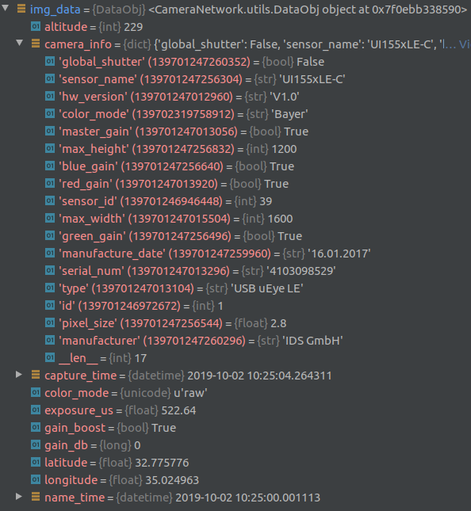

********************************
Using the Camera Network Package
********************************

.. contents:: Table of Contents   


Client
======
After successful installation,
start the Client GUI by navigating to::

    cd cameranetwork/scripts_client

then run ``python camera_client.py``

You should now see

.. image:: images/GUI_on_start.png

after pressing on servers, you should see all connected cameras, in this case camera id 236.

.. image:: images/GUI_servers_with_camera.png

pressing on the camera ID should lead to the camera interface screen

.. image:: images/GUI_main_status.png

sun Shader
----------

.. image:: images/gui_sunshader.png

The angle slider allows manual setting of sunshader angle.
The scan button moves the sunshader throughout it's whole range,
then according to the point with least sunlight (as shown in the graph)
determines the sunshader optimal angel.


Sprinkler
---------

.. image:: images/gui_sprinkler.png

The Sprinkle tab and corresponding button allows to manually activate the sprinkler system
in order to clean the camera len dome. Period Refers to activation time in seconds.

Camera (server)
===============


Field Deployment
----------------

#. Verify Case Screws fully tightened.

#. Verify plugs fully screwed.

#. Verify sprinklers are pointing in the right direction

#. Verify camera alignment with north-south

Code
----

After changing any global_setting.py parameter, need to run setup_camera.py again.

Connection
----------

There are options to connect to the camera

Serial connection
`````````````````

On the Client's PC, from cameranetwork folder:

``bash scripts/listusb.sh`` to list all connected usb devices and to find the relevant one.
Should be /dev/tty/USB0 (replace '0' with relevant number)

#. Follow `driver installation instructions by Odroid <https://wiki.odroid.com/accessory/development/usb_uart_kit>`_.

#. Linux: Run ``sudo minicom`` in Client PC's terminal. Windows: Use Teraterm.

#. Enter odroid username

#. Enter odroid password

SSH
```

#. Via SSH

GUI
```

#. Via GUI (as mentioned in the client section)


Proxy
=====
To connect to the proxy
-------------------------
``sudo ssh -i <path_to_key> ubuntu@<proxy_ip>``

.. note:: 
    ``sudo chmod 400 <path_to_private_key>``
    if permission error is encountered.

.. note::
    *<path_to_key>* is the path and name of the proxy's private key
    *<proxy_ip>* is defined in *global_settings.py*. Currently *3.123.49.101*

If this is the initial setup of the proxy server::

    screen -S session_name
    python ./code/cameranetwork/scripts_proxy/start_proxy.py --log_level info

Should be run from the root of the server, otherwise the logs would be put in a different location each time.
Screen is used to be able to detach and retrieve when ever needed.

- Press *ctrl+a* then *ctrl+d* to detach the *start_proxy.py* from the terminal
- ``screen -ls`` to see detached processes. then ``screen -r <name>`` to bring it back.


Noticable stuff
---------------
*tunnel_port_<camera_id>.txt* stores the odroid's password and tunnel_port (random int between 20,000 and 30,000).

*/proxy_logs/cameralog_<date+time of ____ initialization>_proxy.txt* is a log.
Mainly shows Heartbeats from connected cameras and notification of message transmissions to/from the client.

Others
======

Image Acquisition flow
----------------------
On Odroid: rc.local --> main(start_server.py) --> start(server.py).278 -->
loop_timer(server.py) --> handle_loop(controller.py) --> safe_capture(controller.py)
--> IDSCamera.capture (cameras.py)

Useful commands
---------------
- ``ps -ef | grep python``  to view running python processes (should see start_proxy.py!)
- ``sudo netstat -a -nlp -o | grep 198`` to see status of relevant ports
- `adding ssh key to ssh-agent <https://help.github.com/en/articles/generating-a-new-ssh-key-and-adding-it-to-the-ssh-agent#adding-your-ssh-key-to-the-ssh-agent>`_.
- `How to use scp to transfer files <https://linuxize.com/post/how-to-use-scp-command-to-securely-transfer-files/>`_.
  For example to retrieve proxy log from proxy to client: ``scp ubuntu@3.123.49.101:/home/ubuntu/proxy_logs/cameralog_190929_092735_proxy.txt /home/shubi/Desktop/log``
- gparted for microsd / eMMC partitioning & direct copying.
- ``sudo dd if=/dev/sdb of=~/xu4_lab.img status=progress`` to create an image of odroid
- `etcher <https://www.balena.io/etcher/>`_ to flash image onto the SD card
- ``grep -a -e "Unregistering worker 236" -e "Registering new worker 236" cameralog_190929_092735_proxy.txt``
    to see connections and disconnections. replace log.txt with * for all logs in folder.
- ``du -h --max-depth=1 | sort -hr`` to see size of all subfolders     
 


Data Structures
---------------
When looking at a specific camera, under `captured_images`,
for each that the camera recorded a folder `<%Y-%M-%D>` is created.
Inside, the images are stored as `.mat` files. In addition there is a thumbnail `.jpg` version, add metadata as `.pkl`.
The name is `utctime_date+exact time`.
The `.pkl` file stores the following data::

    img = pd.read_pickle('~/captured_images/2019_10_02/1570011900.0_2019_10_02_10_25_00_3.pkl')



In addition, one `database.pkl` is created and stored per day::

    database = pd.read_pickle('~/captured_images/2019_10_02/database.pkl')
    database.head()

    Time                hdr   path                                                                            longitude  latitude   altitude  serial_num
    2019-10-02 00:00:00 0    /home/odroid/captured_images/2019_10_02/1569974400.05_2019_10_02_00_00_00_0.mat  35.024963  32.775776  229       4103098529
    2019-10-02 00:30:00 0    /home/odroid/captured_images/2019_10_02/1569976200.05_2019_10_02_00_30_00_0.mat  35.024963  32.775776  229       4103098529
    2019-10-02 01:00:00 0    /home/odroid/captured_images/2019_10_02/1569978000.05_2019_10_02_01_00_00_0.mat  35.024963  32.775776  229       4103098529
    2019-10-02 01:30:00 0    /home/odroid/captured_images/2019_10_02/1569979800.05_2019_10_02_01_30_00_0.mat  35.024963  32.775776  229       4103098529
    2019-10-02 08:48:03 0    /home/odroid/captured_images/2019_10_02/1570006083.33_2019_10_02_08_48_03_0.mat  35.024963  32.775776  229       4103098529


Analyzing Results
-----------------
On Client PC::

    cd /cameranetwork/scripts_client
    python start_local.py <path_to_experiment_data>

.. note::

    - Make sure to activate environment beforehand: ``conda activate cn_client``
    - -l flag is used for local proxy (instead of real proxy server)
    - -d flag is for opening gui separately.

workflow + data structure:

#. Run ``python start_local.py -d ~/experiment_23_09_2019`` in the background
where `experiment_date` is a folder containing `cam_ID` folder for each camera involved.
Each `cam_ID` should consist of

    #. `captured_images` folder which stores inside a folder with images(.jpg, .mat & .pkl versions) and database.pkl for each day that the camera recorded.
    #. `dark_images` folder
    #. `sun_positions` folder, containing a folder with .csv containing the positions of the sun (and moon!) with format: timestamp, object, pos_x, pos_y, sunshader_angle, row each 6 minutes for sun and every 1 minute for moon.
    #. Additional pkl's and json's and other (important!) files.

#. Run ``python camera_client.py``
#. You should see a list of all real & virtual cameras.
