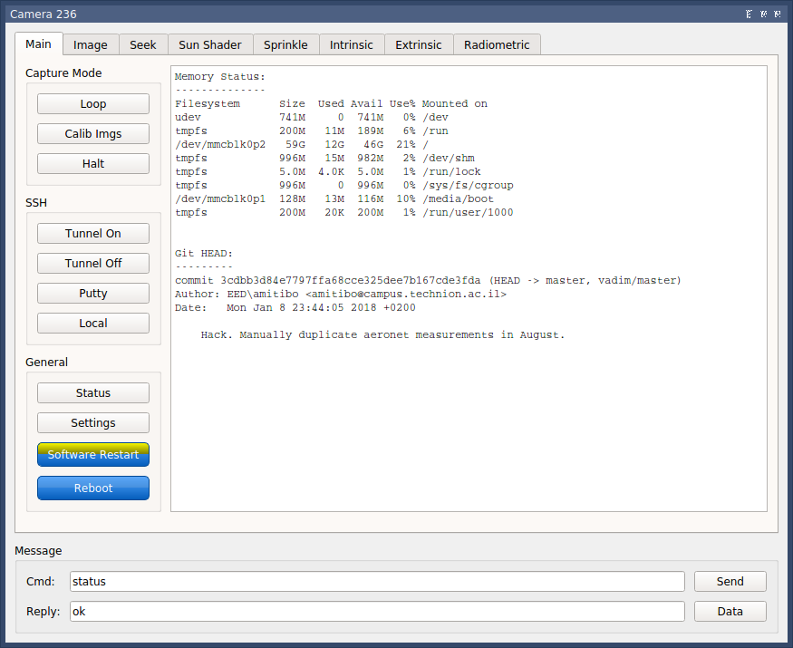

********************************
Using the Camera Network Package
********************************

.. contents:: Table of Contents   

Client
======
After successful installation,
start the Client GUI by navigating to::

    cd cameranetwork/scripts_client

then run ``python camera_client.py``

You should now see

.. image:: images/GUI_on_start.png

after pressing on servers, you should see all connected cameras, in this case camera id 236.

.. image:: images/GUI_servers_with_camera.png

pressing on the camera ID should lead to the camera interface screen

sun Shader
----------

The angle slider allows manual setting of sunshader angle.
The scan button moves the sunshader throughout it's whole range,
then according to the point with least sunlight (as shown in the graph)
determines the sunshader optimal angel.

Sprinkler
---------

.. image:: images/gui_sprinkler.png

The Sprinkle tab and corresponding button allows to manually activate the sprinkler system
in order to clean the camera len dome. Period Refers to activation time in seconds.

Camera (server)
===============
There are options to connect to the camera

Serial connection
-----------------
On the Client's PC, from cameranetwork folder:
#. ``bash scripts/listusb.sh`` to list all connected usb devices and to find the relevant one.
Should be /dev/tty/USB0 (replace '0' with relevant number)
#. Follow `driver installation instructions by Odroid<https://wiki.odroid.com/accessory/development/usb_uart_kit>`_.
#. Linux: Run ``sudo minicom`` in Client PC's terminal.
#. Windows: Use Teraterm.
#. Enter odroid username
#. Enter odroid password

#. Via SSH

#. Via GUI (as mentioned in the client section)

Proxy
=====
To connect to the proxy
-------------------------
``sudo ssh -i <path_to_key> ubuntu@<proxy_ip>``

.. note:: 
    ``sudo chmod 400 <path_to_private_key>``
    if permission error is encountered.

.. note::
    *<path_to_key>* is the path and name of the proxy's private key
    *<proxy_ip>* is defined in *global_settings.py*. Currently *3.123.49.101*

If this is the initial setup of the proxy server::

    python ./code/cameranetwork/scripts_proxy/start_proxy.py --log_level debug

Noticable stuff
---------------
*tunnel_port_<camera_id>.txt* stores the odroid's password and tunnel_port (random int between 20,000 and 30,000).

*/proxy_logs/cameralog_<date+time of ____ initialization>_proxy.txt* is a log.
Mainly shows Heartbeats from connected cameras and notification of message transmissions to/from the client.

Useful commands
---------------
- ``ps -ef | grep python``  to view running python processes (should see start_proxy.py!)
- Press ctrl+a then ctrl+d to detach the *start_proxy.py* from the terminal
- ``screen -ls`` to see detached processes. then``screen -r <name>`` to bring it back.
- ``sudo netstat -a -nlp -o | grep 198`` to see status of relevant ports

