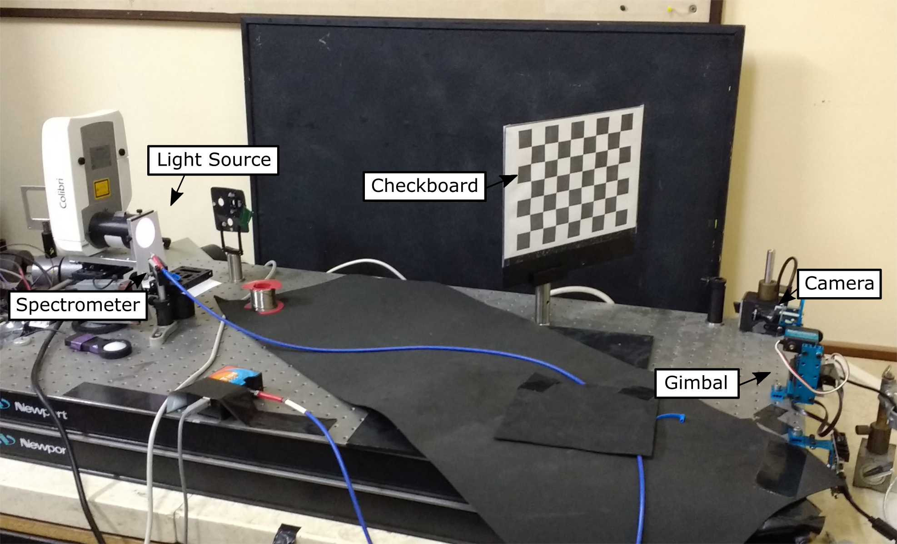

.. highlight:: sh

******************************
Calibrating the Camera Network
******************************

Calibration of the camera network is done in several stages. Part of it is done in
the lab using a custom calibration setup. Another part is done in the field using
the sunphotometer of the `Aeronet system <http://aeronet.gsfc.nasa.gov/cgi-bin/type_one_station_opera_v2_new?site=Technion_Haifa_IL&nachal=2&level=2&place_code=10>`_.

.. _calibration-setup:

   Camera calibration setup.

Geometric Calibration
=====================

Geometric calibration is done

Intrinsic Calibration
---------------------

Intrinsic calibration is done using a checkboard target and using the `pyfisheye <https://bitbucket.org/amitibo/pyfisheye>`_
package which is based on the opencv fisheye calibration toolbox.

Extrinsic Calibration
---------------------

Extrinsic calibration is the determination of the orientation of the camera in the global
coordinates system. It is based on tracking the sun position.

Radiometric Calibration
=======================

Each camera is calibrated relation the a custom calibration setup (Figure :num:`calibration-setup`).